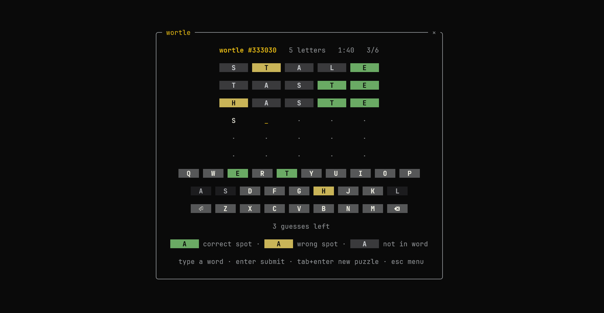
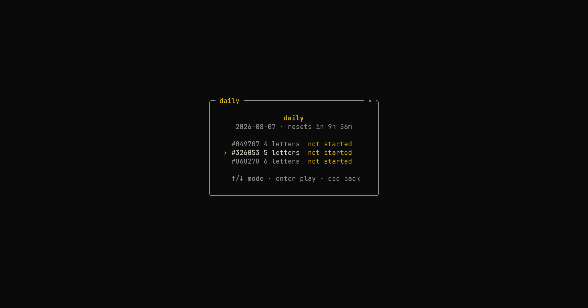
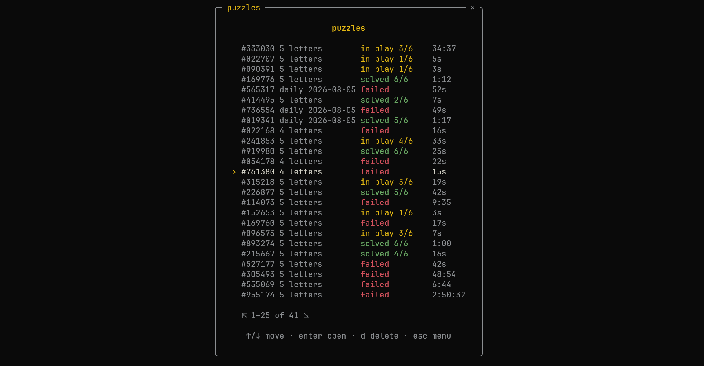
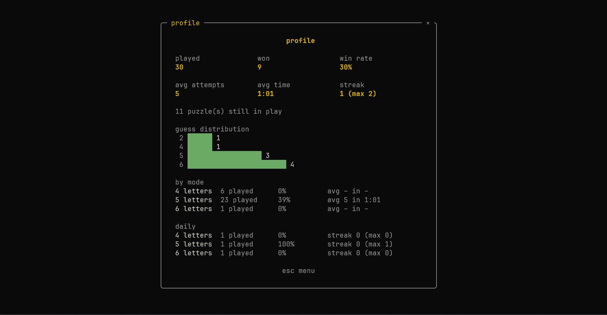

<div align="center">

# surmise

**the word game for the terminal.** fast, themeable, remembers where you left off.

[](https://github.com/nxck2005/surmise/actions/workflows/ci.yml)
[](https://pkg.go.dev/github.com/nxck2005/surmise)

[](https://charm.land)


</div>

```sh
go install github.com/nxck2005/surmise@latest
surmise

# shell can't find it? add go's bin directory to your PATH:
echo 'export PATH="$PATH:$(go env GOPATH)/bin"' >> ~/.zshrc && source ~/.zshrc    # zsh
echo 'export PATH="$PATH:$(go env GOPATH)/bin"' >> ~/.bashrc && source ~/.bashrc  # bash
fish_add_path (go env GOPATH)/bin                                                 # fish
```

no go toolchain? install the latest prebuilt binary in one line:

```sh
curl -fsSL https://raw.githubusercontent.com/nxck2005/surmise/main/install.sh | sh
```

it verifies the checksum, installs to `~/.local/bin` (override with
`SURMISE_INSTALL_DIR`), and never needs sudo. pin a version with
`SURMISE_VERSION=v0.5.1`, or grab an archive by hand — every release carries one:

| platform | file |
| --- | --- |
| linux | `surmise_<version>_linux_amd64.tar.gz` · `..._linux_arm64.tar.gz` |
| macos | `surmise_<version>_darwin_arm64.tar.gz` (apple silicon) · `..._darwin_amd64.tar.gz` (intel) |
| windows | `surmise_<version>_windows_amd64.zip` · `..._windows_arm64.zip` |

each release also ships a `checksums.txt`:

```sh
sha256sum -c checksums.txt --ignore-missing
```

## why you'd want it

**more options for word sizes.** play 4, 5 or 6 letters! shorter is
tighter, longer gives you a guess more room. pick which one you open on, or let
it just follow whatever you played last.

**quit whenever.** every guess is saved the moment you make it. come back whenever!

**finish with a result.** every win or loss gets a compact debrief you can copy
without spoiling the answer, review on the board, or use to start the next game.

**sprint.** solve as many boards as the clock allows — 10 seconds to 10
minutes, your pick of length. one setup, no pauses, a summary at the end.

**it keeps score.** win rate, average attempts, average solve time, current and
best streak, guess distribution, all broken down by mode.

**wide assortment of themes, live preview.**  ember, catppuccin, dracula, gruvbox,
nord and a lot more. write your own themes as well.

**built to be mouse first.** all of it.

**no network required.** plays offline forever.

## playing

| key | action |
| --- | --- |
| letters | type a guess |
| <kbd>enter</kbd> | submit |
| <kbd>backspace</kbd> | delete a letter |
| <kbd>tab</kbd> then <kbd>enter</kbd> | new puzzle (not on the daily — there's one a day) |
| <kbd>enter</kbd> / <kbd>r</kbd> | review the board from a result |
| <kbd>n</kbd> | next puzzle from a result (the daily returns to its mode list) |
| <kbd>c</kbd> | copy a spoiler-safe result |
| <kbd>esc</kbd> | back to the menu (in a sprint: ends the run and shows the summary) |
| <kbd>↑</kbd>/<kbd>↓</kbd> · <kbd>enter</kbd> | navigate menus |
| <kbd>d</kbd> twice | delete the selected puzzle (in the puzzle list) |
| <kbd>r</kbd> | re-read the themes directory (in the theme picker) |
| <kbd>q</kbd> / <kbd>ctrl+c</kbd> | quit (an in-progress puzzle is saved) |

## the daily



one puzzle a day in each mode, the same board for everyone.

## sprint

a timed run: pick a length and how long the clock runs (10s to 10m), then solve
as many boards as it lets you. boards deal themselves — no result screen, no
pauses — and every puzzle counts on your profile like any other. when the clock
ends you get one summary; the board it caught mid-flight is saved like any
other puzzle. <kbd>esc</kbd> ends a run early.

## your puzzles



everything you've played, newest first. <kbd>enter</kbd> resumes, <kbd>d</kbd>
twice deletes.

## your profile



averages cover wins only, so a bad day doesn't get to inflate your solve time.
you can add an optional local display name in settings. it is just a profile
label, not an account or sign-in.

**playtime** is every minute you've spent on a board — wins, losses, puzzles
you're halfway through, and custom ones too. it's a counter, so deleting a
puzzle never takes its time back. want it without opening the app:

```sh
surmise -playtime        # 12h 04m played
```

## themes

```sh
surmise -themes          # list what's installed, and where the directory is
surmise -theme dracula   # play with a theme without changing your saved choice
```

bundled: `tokyo-night` (the default), `deuteranopia`, `ember-dark`, `ember-light`,
`catppuccin-mocha`, `dracula`, `everforest-dark`, `gruvbox-dark`,
`high-contrast`, `matrix`, `nord`, `rose-pine`, `solarized-dark`, `terminal`.

writing your own needs a file on disk, so it's terminal-only; the browser build
ships the bundled set.

yours go in `~/.config/surmise/themes`. a whole theme can be two lines:

```toml
name = "just the accent"
accent = "#ff0088"
```

anything you leave out keeps its built-in value. glyphs and spacing are themeable too. full
reference in [docs/THEMES.md](docs/THEMES.md).

edits apply live — save the file and the colours change under you, no restart.
(<kbd>r</kbd> in the picker reloads on the spot.)

## settings

the settings screen holds an optional local profile name, the mode new puzzles
start in, whether playing a different mode makes *that* the new default, how
much the board animates, and the splash: whether you get one, which ascii art it
draws, how it goes away, and how long it stays up when it's timed. a fresh
install waits for any key on the splash. cycling choices save immediately; the
name editor saves on enter.

**motion** is `off`, `restrained` or `pronounced`. tiles turn one at a time, a
refused guess flashes, keycaps light as you type, and a win accents the frame —
none of it moves anything, and nothing ever waits on it: type straight through,
and any key skips to the result. if you've asked your system for less animation
(`$NO_MOTION`, or *prefers-reduced-motion* in a browser) it starts off.

```sh
surmise -length 6        # start in a mode for one run, without saving it
surmise -splash off      # skip the startup art for one run
surmise -splash random   # a different banner each launch
surmise -motion off      # a still board for one run
surmise -day 2026-08-06  # play another date's daily, without waiting for it
surmise -data ./scratch  # keep saves and settings somewhere else
```

saves and settings otherwise live in your user config directory
(`~/.config/surmise` on linux).

## backing it up

everything you've played is on this machine, in one copy. one file takes all of
it — puzzles, settings and any themes you wrote — somewhere safe, or onto
another machine.

the **backup** row in the menu is the whole thing: *save a backup* writes one,
*load a backup* merges one back. in the terminal the file goes in
`~/.config/surmise/backups`, dated, and the screen tells you the path. in the
browser it's an ordinary download and an ordinary file picker — which is the way
to get your history out of a browser at all, since clearing site data takes it
with it.

from the command line:

```sh
surmise -export mine.backup.json   # write the lot to a file
surmise -import mine.backup.json   # merge one back in
```

an import **only ever adds**. a puzzle you already have is left exactly as it
is, a setting you've already chosen is never overwritten, and your playtime only
ever goes up. so importing the wrong file costs you nothing, and importing the
same one twice does nothing the second time.

both take `-` for stdout and stdin, so a backup can be piped straight somewhere
else:

```sh
surmise -export - | gpg -e -r me > mine.backup.json.gpg
```

`-export` won't write over a file that's already there — back up to a new name
rather than over an old one.

## where your data lives

everything surmise keeps is on this machine, in one folder — `~/.config/surmise`
on linux, `~/Library/Application Support/surmise` on macos, `%AppData%\surmise`
on windows. inside it:

- `puzzles/` — one small json file per puzzle you've played
- `settings.json` — your preferences, plus the playtime counter
- `themes/` — themes you wrote
- `backups/` — backups written from the menu

nothing leaves the machine: no account, no telemetry, no network at all. the
browser build keeps the same things in the site's storage instead — see
[in a browser](#in-a-browser). either way, every save file now carries a schema
number, so an upgrade can never quietly misread your history.

to uninstall completely, delete the binary and that folder — nothing is
installed anywhere else. in a browser, clearing the site's data is the whole
uninstall.

## about

the **about** row in the menu shows app info. for getting the version without opening the app:

```sh
surmise -version         # surmise 1.2.3 (a1b2c3d) go1.26.5 linux/amd64
```

## in a browser

**play it at [surmise.nxck.dev](https://surmise.nxck.dev)** — the same game
compiles to webassembly and runs on xterm.js, so there is nothing to install and
no server. saved puzzles go to `localStorage` instead of a config directory, and
only the bundled themes come along.

that storage belongs to the origin, so clearing site data erases everything and
nothing can bring it back — the **backup** row downloads the lot as one file,
and loads it again on any machine.

to build and serve it yourself:

```sh
scripts/build-web.sh              # writes web/dist
python3 -m http.server -d web/dist
```

<!-- Absolute on purpose: the release archives carry no wasm and so no
     docs/WEB.md, and a relative link would dangle inside every one. -->
details, and the query-string equivalents of the flags, in
[docs/WEB.md](https://github.com/nxck2005/surmise/blob/main/docs/WEB.md).

## development

```sh
go run .                    # play from a clone
go test ./...
go test -race ./internal/...
scripts/build-web.sh        # build the browser bundle into web/dist
go run ./tools/genwords     # regenerate the embedded word lists
go run ./tools/gennotices   # regenerate THIRD_PARTY_NOTICES.md after a dep change
```

`internal/game`, `store`, `words` and `stats` are the ui-agnostic core;
`internal/ui` is the bubble tea layer on top. the ui has tests too: they drive
the root model with synthetic key and mouse events and assert on the rendered
frame, so no tty is involved.

word-list provenance in
[internal/words/data/SOURCES.md](internal/words/data/SOURCES.md).

## licence

surmise's own code, docs and data are mit licensed — see
[LICENSE](LICENSE).

the linked go modules, the themes adapted from other people's palettes, and the
word lists stay under their own terms. all of them are permissive, all of them
are reproduced in full in
[THIRD_PARTY_NOTICES.md](THIRD_PARTY_NOTICES.md), and that file ships inside
every release archive. regenerate it with `go run ./tools/gennotices` after any
dependency change.

not affiliated with the new york times company or any other rights holder in a
similar game.

---

<div align="center">

inspired by [monkeytype](https://monkeytype.com) · mit licensed

</div>
